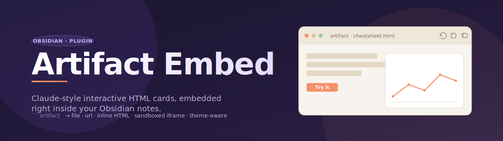

<p align="center">
  
</p>

<p align="center">
  <a href="https://obsidian.md/"></a>
  <a href="LICENSE"></a>
  
</p>

**Artifact Embed** lets you drop interactive HTML — local files, remote URLs, or inline source — straight into your Obsidian notes as Claude-Desktop-style cards. Each artifact runs in a sandboxed iframe, inherits your Obsidian theme variables, and gives you a tiny toolbar to reload, open externally, or copy the source.

## Why?

Plain Obsidian only renders Markdown. If you want a tabbed cheatsheet, a chart widget, or a self-contained mini-tool inside a note, your choices are: (a) paste raw HTML and pollute the note's global CSS, (b) launch a dedicated HTML viewer in a separate tab, or (c) iframe a URL into a sidebar pane. None of these put a polished, sandboxed, theme-aware artifact card *inline* next to your prose. That's what this plugin does.

## Features

- **One unified syntax** — a single `` ```artifact `` code block that auto-detects whether its body is a path, a URL, or inline HTML.
- **Sandboxed by default** — every artifact runs in `<iframe sandbox="allow-scripts">` with no same-origin access; iframe JS can't reach your vault, cookies, or `window.parent`.
- **Theme-aware** — Obsidian's CSS custom properties (`--background-primary`, `--text-normal`, `--font-text`, …) are injected into the iframe, so `var(--text-normal)` inside your HTML follows light/dark mode.
- **Card chrome with toolbar** — 🔄 reload · 🌐 open externally · 📋 copy source.
- **Works in both Reading mode and Live Preview** — piggybacks on Obsidian's native post-processor pipeline, no separate CodeMirror plugin needed.
- **Per-block overrides** — first line of the code block can carry directives like `height=600 title="My Demo"`.

## Usage

### Embed a vault file

````markdown
```artifact
Assets/cheatsheet.html
```
````

### Embed an external URL

````markdown
```artifact
https://example.com/
```
````

> Many production sites set `X-Frame-Options: DENY` or a strict CSP — those will refuse to render inside an iframe. That's the remote site's choice, not the plugin's limitation.

### Inline HTML

````markdown
```artifact
height=320 title="Counter"
<!doctype html>
<html>
<body>
  <button id="b">+1</button>
  <span id="n">0</span>
  <script>
    let count = 0;
    document.getElementById('b').onclick = () => {
      document.getElementById('n').textContent = ++count;
    };
  </script>
</body>
</html>
```
````

### Detection rules

The plugin classifies the code block body by these rules:

| Body looks like | Treated as |
|---|---|
| Single line starting with `http://` or `https://` | external URL → `<iframe src=…>` |
| Single line ending in `.html`/`.htm`, no `<` chars | vault path → load file → `<iframe srcdoc=…>` |
| Anything else | inline HTML → `<iframe srcdoc=…>` |

### Directives (optional first line)

If the **first line** of the code block matches `key=value` syntax (and contains no `<`), it's parsed as directives:

| Key | Effect | Default |
|---|---|---|
| `height` | iframe height in px | `480` |
| `title` | text shown in the card header | source path / URL / `inline HTML` |

```artifact
height=600 title="Big chart"
<svg>…</svg>
```

## Install

This plugin isn't in the community plugin browser yet. To install from source:

1. Download `manifest.json`, `main.js`, and `styles.css` from the latest [release](https://github.com/LeonYew-Ley/obsidian-artifact-embed/releases) (or clone this repo)
2. Drop them into `<your-vault>/.obsidian/plugins/obsidian-artifact-embed/`
3. Reload Obsidian (`Ctrl+P` → *Reload app without saving*)
4. Open *Settings → Community plugins*, enable **Artifact Embed**

## Security model

The iframe is sandboxed with `allow-scripts allow-forms allow-popups allow-modals`. **`allow-same-origin` is deliberately omitted.** Consequences:

- ✅ Scripts inside the iframe run normally
- ✅ Forms, popups, modals work for self-contained tools
- ❌ Iframe JS cannot read or write `window.parent`, `document.cookie`, `localStorage`, or vault state
- ❌ Iframe JS cannot make same-origin requests to your filesystem

If you ever need that kind of access, you almost certainly want a different plugin (Templater, Dataview JS, CustomJS). This one's design line is: *render untrusted HTML safely*.

## Limitations / known gaps

- **No content-aware auto-resize.** Height is fixed (default 480px); override per block via `height=…`. Auto-resizing would require sending a `postMessage` from inside every embedded document, which we deliberately don't enforce.
- **Remote sites with strict frame policies won't load.** That's a server-side block — no plugin can defeat it.
- **No settings tab in v0.1.** Default height / sandbox flags are hard-coded for now.

## Examples

See [`examples/test-note.md`](examples/test-note.md) — drop it into a vault to verify all three syntaxes render correctly.

## Banner credit

The banner is hand-written SVG (`docs/banner.svg`) — no external tooling needed. If you want to make your own plugin banner, popular free options include:

- **[Figma](https://www.figma.com/)** — most common, free tier, great export to PNG/SVG
- **[Penpot](https://penpot.app/)** — fully open-source Figma alternative
- **[Canva](https://www.canva.com/)** — template-driven, fastest for non-designers
- **[Excalidraw](https://excalidraw.com/)** — sketchy aesthetic, also exists as an Obsidian plugin
- **[Satori](https://github.com/vercel/satori)** — generate banners from JSX, programmatically (FOSS, by Vercel)

## License

[MIT](LICENSE) © LeonYew-Ley
